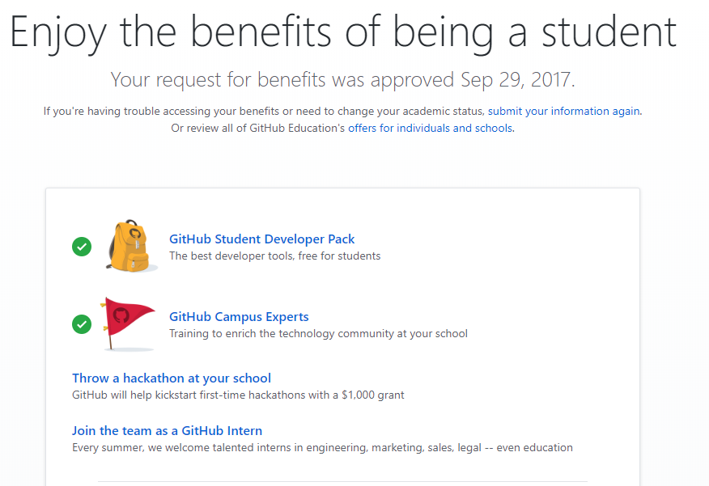
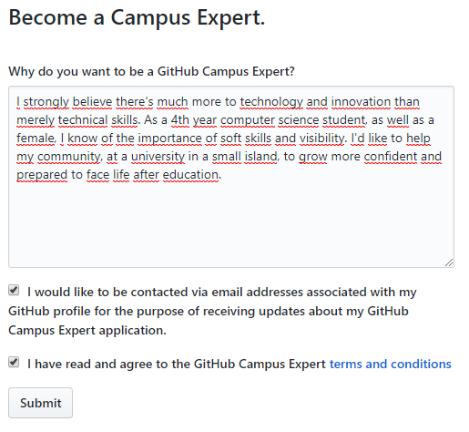
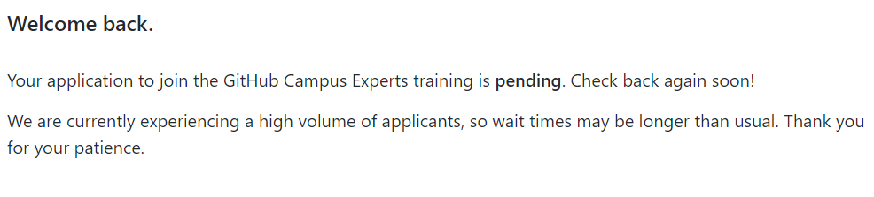

# Práctica Bono

Esta práctica pretende mejorar las competencias transversales mediante el desarrollo de una página con GitHub Pages.  

## Tareas

Las tareas a realizar son:
- [ ] Realizar el curso Become a Campus Expert de GitHub.
- [x] Solicitar el Student Developer Pack.
- [ ] (Opcional) Solicitar una GitHub Internship.

### Student Developer Pack

Aquí se puede ver que tengo el Student Developer Pack desde septiembre de 2017.

### Campus Expert

Para poder hacer el curso _Become a Campus Expert_ he tenido que hacer una solicitud.

Tras hacer la solicitud, ha quedado pendiente de aprobación.

## Datos personales

Sara Revilla Báez - @[mizsrb](https://github.com/mizsrb)  

Procesadores de Lenguajes  
Universidades de La Laguna
